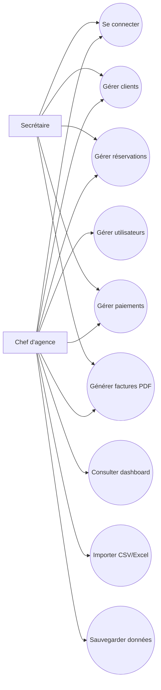
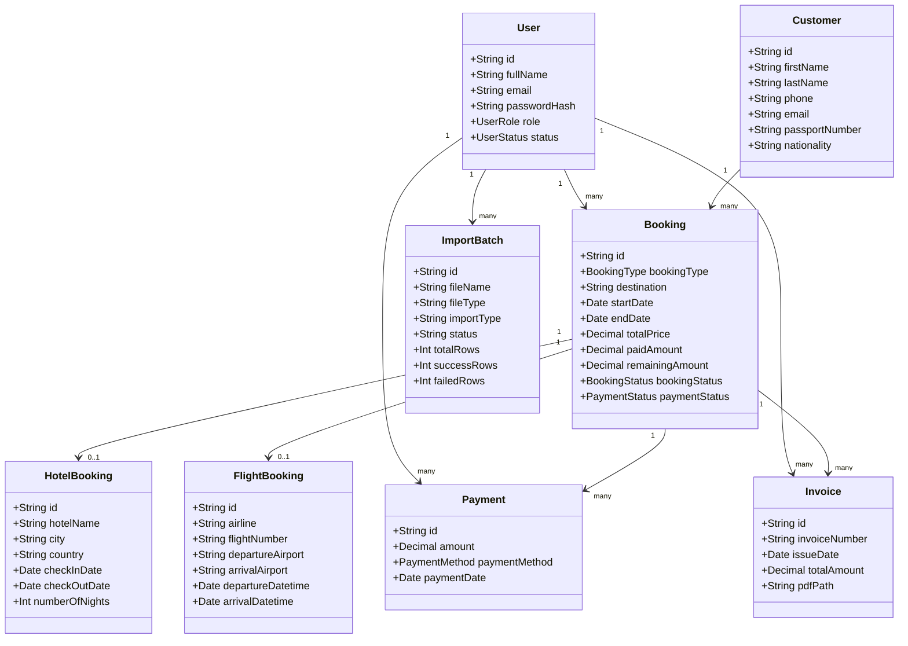
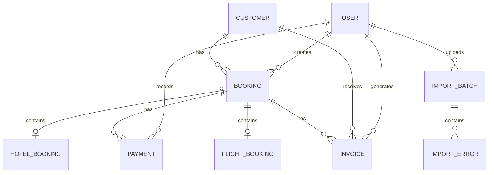
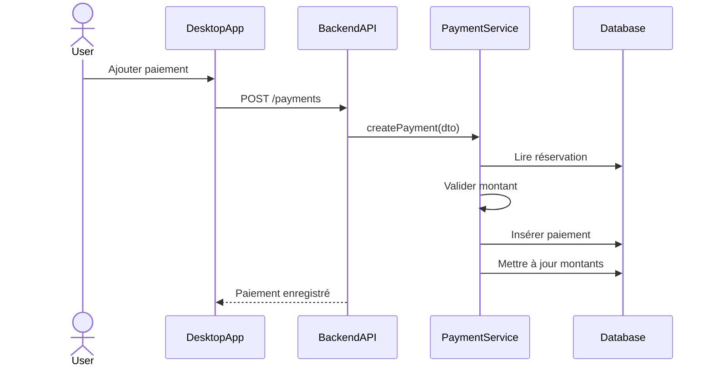
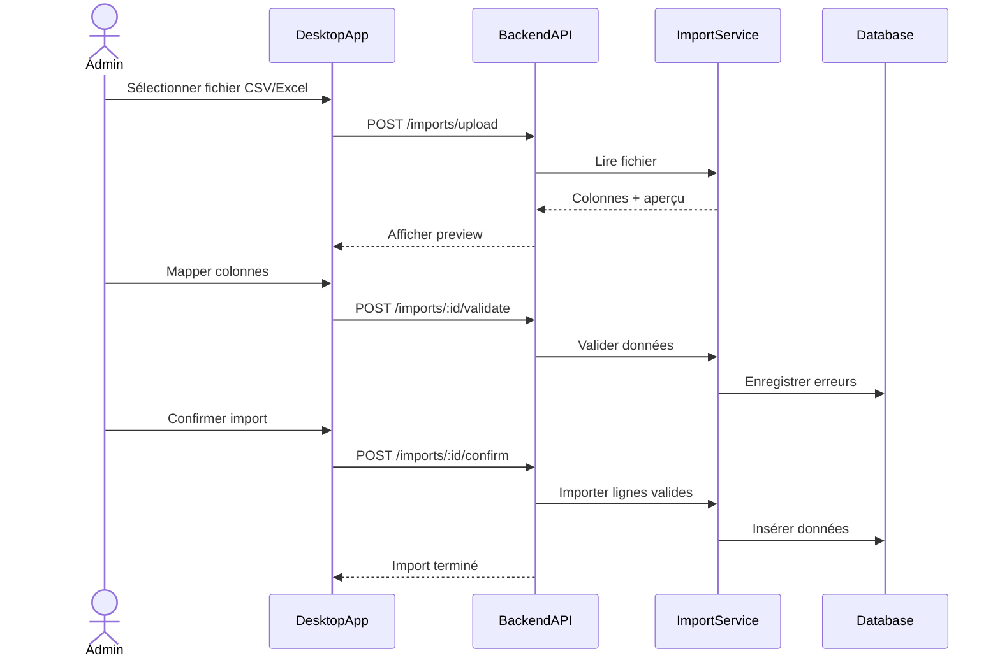

# Diagrammes UML

## 1. Diagramme de cas d’utilisation

## 2. Diagramme de classes principal

## 3. Diagramme entité-relation

## 4. Séquence — ajout paiement

## 5. Séquence — import CSV/Excel

